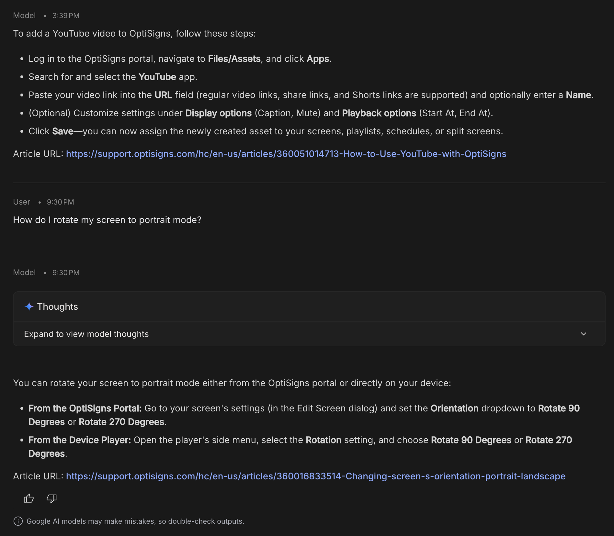

# kb-sync

Daily scraper for a Zendesk Help Center → clean Markdown → **Gemini File API** (grounded knowledge base). Delta-only uploads, idempotent, runs on a free daily cron.

## Pipeline

1. Pull every published article from `https://<subdomain>/api/v2/help_center/en-us/articles.json`.
2. Convert each to Markdown with front-matter + an `Article URL:` line the model cites verbatim.
3. Hash `title + body`, compare against `data/state.json`:
   - **new** → upload, remember `file_name`
   - **hash changed** → delete old `file_name`, upload new
   - **unchanged but > 40h old** → refresh (Gemini File API TTL is 48h)
   - **unchanged & fresh** → skip
4. Log `added / updated / refreshed / skipped`.

## Why Gemini File API (and not a vector store)

The brief allows *"OpenAI Vector Store or Google Gemini equivalent"*. Gemini has two knowledge-base options and only one is reachable with an API key:

| Option | Auth | Vector store? | Chosen |
|---|---|---|---|
| **Gemini File API** | API key | Files-as-context (model retrieves at inference) | ✅ Yes |
| Semantic Retrieval (`corpora`) | OAuth 2.0 only | True vector store (chunk + embed + retrieve) | ❌ Ruled out — OAuth not workable in a cron secret |

The File API is the primitive **Google AI Studio itself uses** when you attach knowledge sources to a system prompt. It is the equivalent OptiSigns' brief accepts, with one honest trade-off: no server-side chunking. At this scale it does not matter — 35 articles × ~15 KB = ~500 KB, comfortably inside Gemini 3.8 Flash's 1M-token context. Each query attaches all current file handles as native `Part`s to `generate_content` and the model does its own retrieval over them. Above ~200 articles the trade-off would flip and I would switch to a self-hosted embedding + retrieval layer (pgvector) rather than move to OAuth.

## Setup

```bash
cp .env.sample .env       # fill GEMINI_API_KEY (free at aistudio.google.com/apikey)
python -m venv .venv && source .venv/bin/activate
pip install -r requirements.txt
python main.py            # ARTICLE_LIMIT=35 for a quick run
```

## Test the assistant

```bash
python chat.py "How do I add a YouTube video?"
```

Or in Google AI Studio: paste the system prompt from the brief, attach `data/articles/*.md` as sources, ask the sample question.

## Run in Docker

```bash
docker build -t kb-sync .
docker run --rm \
  -e GEMINI_API_KEY=... \
  -v "$PWD/data:/app/data" \
  kb-sync
```

Exits `0` on success.

## Daily job

GitHub Actions cron at `03:00 UTC` — [.github/workflows/daily-sync.yml](.github/workflows/daily-sync.yml). Add `GEMINI_API_KEY` to repo secrets. State is cached between runs and uploaded as an artifact.

**Latest run logs:** `https://github.com/<user>/kb-sync/actions/workflows/daily-sync.yml`

## First run

```
added=35 updated=0 refreshed=0 skipped=0 total_tracked=35
```

Second run (within 40h, nothing changed): `added=0 updated=0 refreshed=0 skipped=35` — delta confirmed.

## Screenshot


